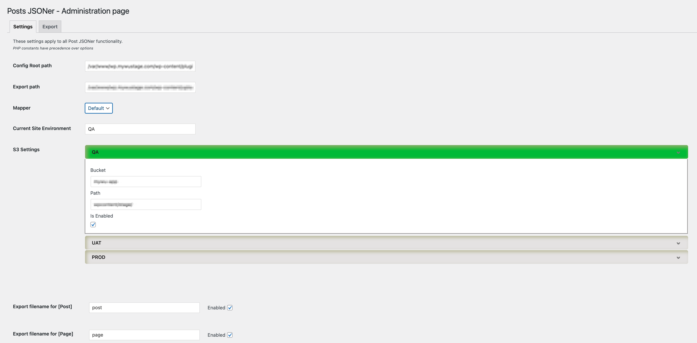
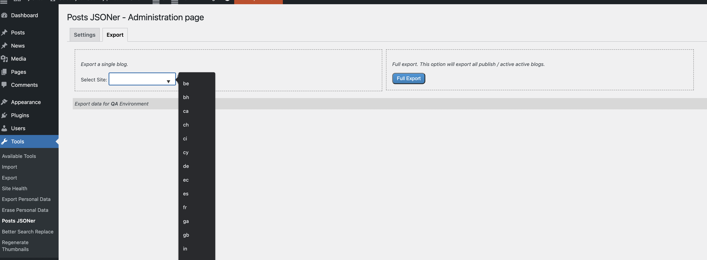

# Post JSONer

A WordPress plugin to export post content to structured JSON for use in various apps (without relying on the WordPress API)

## About

This plugin aims to export content to static JSON files. 
Through the WordPress admin section, it allows to configure export path, S3 buckets, and what post types to be exported. 
In the [Configuration](#configuration) section we will go in depth in those settings, and the WordPress constants required.

The plugin also allows you to configure custom mappings for your export to provide customized structure (especially useful when using nested and repeater fields), which will be covered in the  [Customizations](#customizations) section, (and will also explains how to create and add customs mappers.)  

This plugin supports Multi-site and Multi-language (through the [WPML](https://wpml.org/) plugin.)

The exported data is saved locally, and optionally can be uploaded to S3. The plugin has support for exporting to three environments, allowing you to centrally manage your content in one WordPress instance.

## Configuration

There are two ways to configure this plugin, with [Constants](#constants) and through the [admin page](#wp-options).
Constants should be used for sensitive data that you may want set through environment variables, for example S3 credentials.

In the admin section, you can set the active WordPress environment and environment related settings like S3's bucket.

There are three supported environments:
* QA: it's used for development and testing purpose.
* UAT: this is a pre-production stage, usually mimic production infrastructure. 
* PROD: the Production one.

As mentioned, it is therefore possible to manage content for your three environments from a single WP install, or to simply configure each environment on individual deployments.

### CONSTANTS

All constants should be defined in your `wp-config.php` file so as to be available across the app.

The first one is for active environment, by default *QA*. This one can be overridden in the admin page.
```php
define('WP_SITE_ENV', getenv('WP_SITE_ENV') ?? 'QA');
```

The S3 credentials may be set here too. In the case where any of the definitions of required constants are missing for the active environment,
the upload feature will be automatically disabled.

The format for this set of constants is:

`S3_UPLOADS_<ENVIRONMENT>_KEY - S3_UPLOADS_<ENVIRONMENT>_SECRET - S3_UPLOADS_<ENVIRONMENT>_REGION`

So for example, the definitions for QA would be:
```php
define('S3_UPLOADS_QA_KEY', getenv('S3_UPLOADS_QA_KEY') ?? '');
define('S3_UPLOADS_QA_SECRET', getenv('S3_UPLOADS_QA_SECRET') ?? '');
define('S3_UPLOADS_QA_REGION', getenv('S3_UPLOADS_QA_REGION') ?? '');
```

For UAT:
```php
define('S3_UPLOADS_UAT_KEY', getenv('S3_UPLOADS_UAT_KEY') ?? '');
define('S3_UPLOADS_UAT_SECRET', getenv('S3_UPLOADS_UAT_SECRET') ?? '');
define('S3_UPLOADS_UAT_REGION', getenv('S3_UPLOADS_UAT_REGION') ?? '');

```

And for PROD:
```php
define('S3_UPLOADS_PROD_KEY', getenv('S3_UPLOADS_PROD_KEY') ?? '');
define('S3_UPLOADS_PROD_SECRET', getenv('S3_UPLOADS_PROD_SECRET') ?? '');
define('S3_UPLOADS_PROD_REGION', getenv('S3_UPLOADS_PROD_REGION') ?? '');
```

Last but not least, through constants you can define custom filenames for error logging output,
by default:
```php
define('DEBUG_FILE','/var/log/wp-error.log');
```
(feel free to set this to your existing wp-errors log or use a unique file).

### Settings Page (Admin)

Within the WP Admin UI, options exist to configure the location of your custom config files and export directories, as well as enable and define S3 uploads and toggle/rename exports for custom post types.

First, you can set where the configuration for export format is save. By default, it's inside the plugin's directory
`wp-content/plugins/post-jsoner/config`

The export path, is where the data will be saved. By default, it will be inside the `uploads` folder, but could be changed to any directory that has the appropriate permissions.



In the **Mapper** dropdown, you can select between different custom output mappings saved in the __**config path**__ as a directory
that contains `.json` files that establish the relationship between post objects and the output layout.

In the [Customizations](#customizations) section, we will explain how to create your own maps.

This plugin comes with a default configuration with the structure below:

```json
{
  "post": "post.*",
  "customs": "customs.*"
}
```

**Current Site Environment**, is self-explanatory. It allows you to establish which environment you're running on. it can also be used to publish to different environments if you are centrally managing your content in a single instance across multiple export environments.

The **S3 Settings**, allows you to set the bucket and the path where the exported data will be uploaded. You need only enable and define S3 credentials for environments to which you want to export (e.g. if your Wordpress instance is only running for UAT, you need only enable and set up the bucket references for UAT).

As you can see in the image above, the section highlighted in green matches the current site environment as visual confirmation.

Also, if the constants for S3 (as defined in wp-config) are not set for current environment, the S3 option will be disabled. 

Finally, for each _post type_ (e.g. _post_, _page_, etc.) in a default WordPress installation, as well as any custom post types currently defined in your application,
you can choose whether to export and what tp name the generated file.

## Export

Once you've completed the configuration, it is time to export your Content!

In a multisite install, from the main site, you can choose to perform a __Full Export__, which loop through all active/non-archived sites,
or you can select a specific site to export (available countries will be auto-populated in the list).



When exporting from within a sub-site of a multisite (or from any single site install), you will not have the Full Export option, and the single-site export will be limited to the current site.

## Customizations
